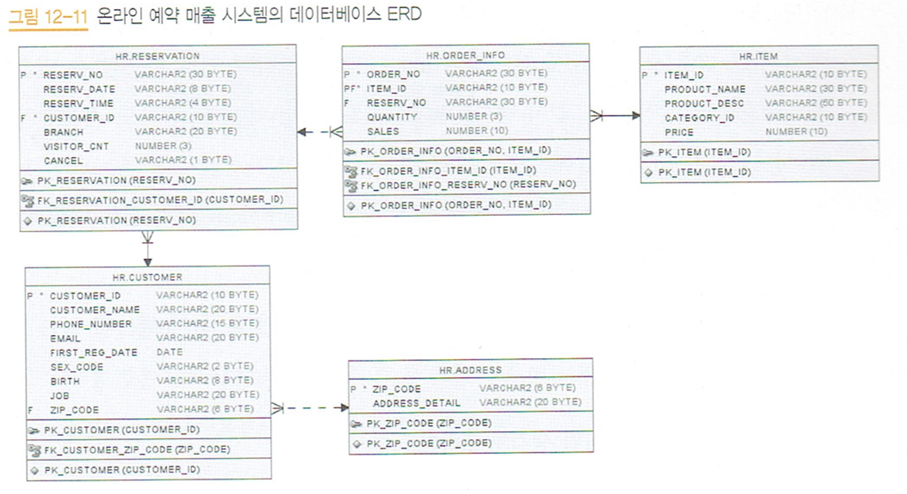

# 모두의 SQL 실습 클론코딩

## [프로젝트 개요]

1. 온라인 전용 상품 시장 반응 분석

## [프로젝트 목표]

1. 실습에서 제공하는 예약 데이터와 매출 데이터를 토대로 데이터 분석
2. oracle 문법을 mariadb 문법으로 바꾸기
3. 기본 SQL문을 학습하고, 데이터 분석 실습을 통해 실무에서 SQL 활용을 학습.

## [ERD]

1. 테이블은 customer, address, reservation, order_info, item으로 구성되어 있다.
2. 주소는 고객을 여러 건 갖는다. 주소가 없어도 고객은 존재할 수 있다.
3. 고객은 예약을 여러 건 갖는다. 고객 없이는 예약이 존재할 수 없다.
4. 예약은 주문을 여러 건 갖는다. 예약 정보 없이도 주문 정보는 존재할 수 있다.
5. 상품 주문은 여려 건 갖는다. 상품이 없다면 주문은 존재할 수 있다.
## [배운점]

### 1. 테이블 생성

- CONSTRAINT PK*이름 PRIMARY KEY (적용 컬럼): PK*이름으로 PK를 생성합니다.
- ALTER TABLE customer ADD CONSTRAINT fk_customer_zip_code FOREIGN KEY (zip_code) REFERENCES address (zip_code); : customer 테이블의 zip_code를 customer_zip_code이름으로 FOREIGN KEY로 지정하고, 이는 address 테이블의 (zip_code)를 참조한다.

### 2. INSERT

- to_date('17/11/07','RR/MM/DD'): to_date(str, 형식)

- str_to_date('17/11/08','%y/%m/%d'): date 값의 형식을 바꿈

### 3. Function
[Oracle to Mariadb]
- DECODE(컬럼, 조건1, 결과1, 조건2, 결과2, 조건3, 결과3..........) : 오라클
  - case
     when 조건1  then  반환값
     when 조건2  then  반환값
     else 반환값
    end

[fuction]
- SUBSTR(str, pos, len) : str문자열을 pos번째 부터 len개 글자만 가져오기
- ROUND(값, 자리수): 값을 자리수까지만 반올림하여 출력

## [궁금증]

### 1. 테이블 생성

- CONSTRAINT nn_reservation_customer_id NOT NULL enable -> NOT NULL

### 2. ERD 화살표 의미, PK와 FK의 의존도 관계
